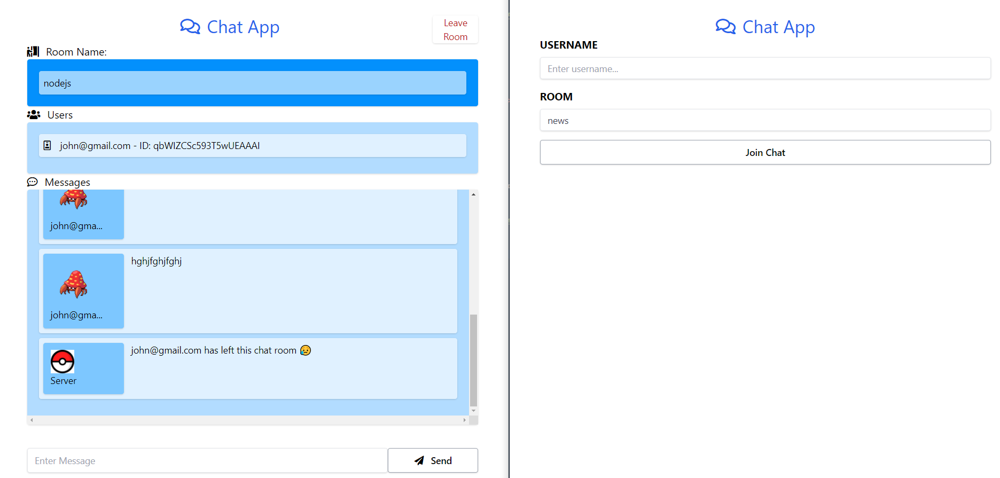

# Multi Room Socket.io Chat Application





```bash  
# to cimpile css for tailwind
$ npm run tail_wind

# create config file with all the default configs
$ npx tailwindcss init --full


# create a new config file
$ npx tailwindcss init
```